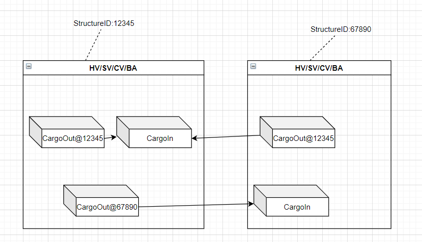

# Cargo Teleporter zwischen zwei Strukturen für 'normale' Spieler

1. Beide Strukturen müssen in der selben Fraktion sein
1. Eine Box/Container mit der Id "CargoOut@\[ZielID\]" beim Versender
1. Eine Box/Container mit der Id "CargoOut@\[ZielID\]#\[IgnoreItemID, ...\]" beim Versender
1. An der Zielstruktur mit der Id ID eine Boc/Container mit dem Namen "CargoIn"

Der Transfer erfolgt immer von "CargoOut@..." nach "CargoIn"

Infoformationen zum Transfer erhält man über LCDs welche mit den Namen "CargoOutInfo" bzw. "CargoInInfo" beginnen.

# Cargo teleporter between two structures for 'normal' players
The Cargo script is one of the ones that you don't have to do anything to activate other than create containers on the structures with naming convention matching above (Must have 'CargoIn' name for receiving container and other container prefixes Must have 'CargoOut@'  specifically for script to function, no deviations in the labels are allowed there other than appending the EntityID after the @ symbol for CargoOut@ containers) 
The arrows depict the flow of items between containers on structures 
